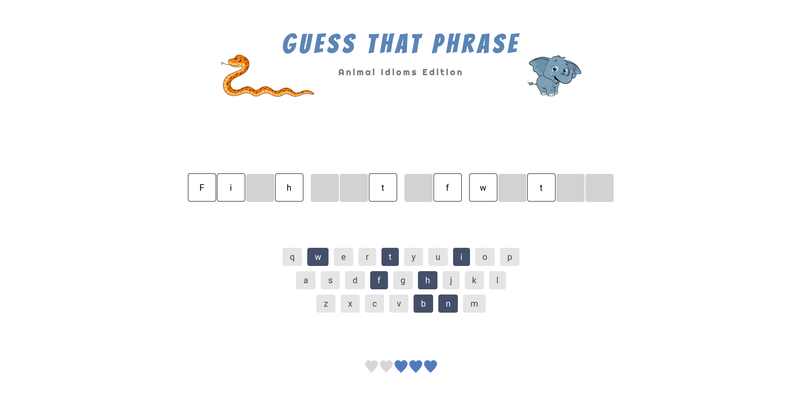
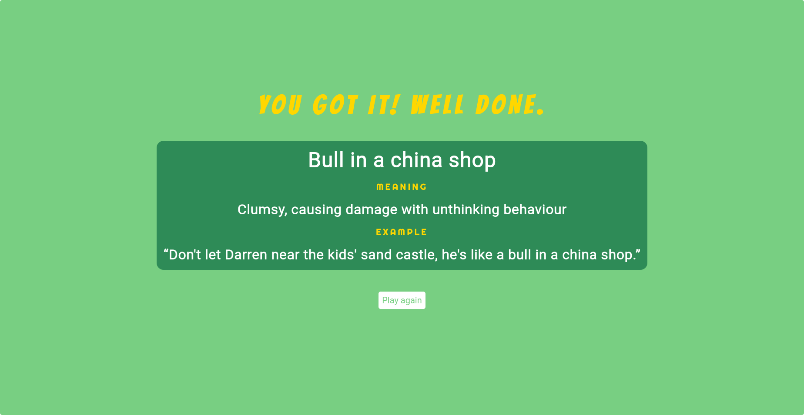

# Phrase guessing game

## Initial project
This project started out as a graded project for Treehouse TechDegree - Front End Web Development. The aim was to practice JavaScript DOM manipulation with a phrase guessing game and it was a great challenge and built my confidence in JavaScript.

## Improvement
Months later, I was learning back end and changed the way the phrases are generated. I created a server side random phrase generation hosted by Heroku and some aesthetic improvements like animations and added definitions and examples of the phrases. I stuck with the original theme of animal idioms for the phrases and added more phrases.

# Links

API GitHub repository [Link](https://github.com/michagodfrey/phrase-api)

Heroku live site [Link](https://random-phrase.herokuapp.com/)

# Screenshots

# Acknowledgements
I followed along on the [#100Devs course lecture](https://www.twitch.tv/videos/1316131994) to set up the Heroku API.

The animal clip art are from [Clipart Library](http://clipart-library.com/) and [here](http://clipart-library.com/clipart/orange-snake-cliparts_13.htm) and [here](http://clipart-library.com/clip-art/elephant-clipart-transparent-3.htm) specifically.

Start button hover effect adapted from [10) Glowing Icon Hover Effects](https://www.proglobalbusinesssolutions.com/css-hover-effects/)

Shake animation adapted from [CSS Tricks](https://css-tricks.com/snippets/css/shake-css-keyframe-animation/)

Spin animation adapted from [Coding Artist Web](https://codingartistweb.com/2021/05/flip-a-coin-html-css-javascript/)

I wrote the meanings and examples of phrases with help from google. The [English Like a Native](https://englishlikeanative.co.uk/30-animal-idioms/) page provided the lion's share of the guidance for the phrases.
