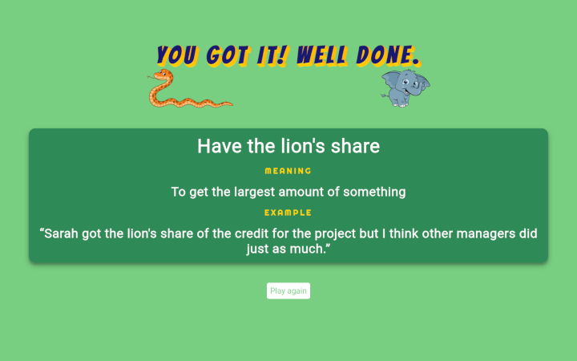

# Phrase guessing game

## Initial project

This project started out as a graded project for [Treehouse TechDegree - Front End Web Development](https://teamtreehouse.com/techdegree/front-end-web-development). The aim was to practice JavaScript DOM manipulation with a phrase guessing game and it was a great challenge and built my confidence in JavaScript.

## Improvement

Months later, I moved the phrases from the client side to the server side hosted by Heroku. I also made some aesthetic improvements like animations and added definitions and examples of the phrases. I stuck with the original theme of animal idioms for the phrases and added more phrases, increasing the original five to twelve.

**Update Aug 2022:** I moved the server to Firebase as Heroku was withdrawing its free hosting. I also added two new phrases and improved the mobile layout although tablet and desktop screens still offer a better user experience.

## Links

API GitHub repository [Link](https://github.com/michagodfrey/phrase-api-firebase)

Firebase live site [Link](https://us-central1-guess-animal-idiom.cloudfunctions.net/app/)

## Screenshots

## Acknowledgements

The animal clip art images are from [Clipart Library](http://clipart-library.com/) and [here](http://clipart-library.com/clipart/orange-snake-cliparts_13.htm) and [here](http://clipart-library.com/clip-art/elephant-clipart-transparent-3.htm) specifically

The background image is from [rawpixel.com on Freepik](https://www.freepik.com/free-vector/cute-group-wild-animals-vector_3780571.htm#&position=2&from_view=detail#query=z&position=2&from_view=detail)

Start button hover effect adapted from [10) Glowing Icon Hover Effects](https://www.proglobalbusinesssolutions.com/css-hover-effects/)

Shake animation adapted from [CSS Tricks](https://css-tricks.com/snippets/css/shake-css-keyframe-animation/)

Heading text shadows generated with [HTML-CSS-JS](https://html-css-js.com/css/generator/text-shadow/)

Spin animation adapted from [Coding Artist Web](https://codingartistweb.com/2021/05/flip-a-coin-html-css-javascript/)

I wrote the meanings and examples of phrases with help from google. The [English Like a Native](https://englishlikeanative.co.uk/30-animal-idioms/) page provided the lion's share of the guidance for the phrases
